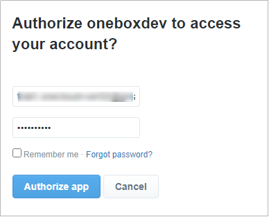

## Authentication Twitter

The token API is used to create tokens for one site. This token will later be used as a mandatory parameter for Twitter Credential API (Get Twitter Auth session).

The token will expire within a certain period. Re-generate token if it has expired.

### Data

|         |     |                                                                                                        |
| ------- | --- | ------------------------------------------------------------------------------------------------------ |
| Method  | :   | GET                                                                                                    |
| URL     | :   | {host}/twitter/auth?redirectUrl={host}/twitter/session                                                 |
| Example | :   | https://ocdev.ciptadrasoft.net/twitter/auth?redirectUrl=https://ocdev.ciptadrasoft.net/twitter/session |
| Return  | :   | {host}/twitter/session?sessionId={session-id}                                                          |

### Parameter

|     Key      |                                                 Value                                                  |                                                           Description                                                            |
| :----------: | :----------------------------------------------------------------------------------------------------: | :------------------------------------------------------------------------------------------------------------------------------: |
|  {hostAPI}   |                                         ocdev.ciptadrasoft.net                                         |  host of API<br/> - “ocdev.ciptadrasoft.net” for environment development<br/> - “cloud.onebox.co.id” for environment production  |
|  {hostSite}  |                                         ocdev.ciptadrasoft.net                                         | host of site<br/> - “ocdev.ciptadrasoft.net” for environment development<br/> - “mysite.onebox.co.id” for environment production |
| {session-id} | WmNOWEhETmFhbmFTNWljWld0NmlUbWRV<br/>K1AvUXk4M0tuSm9NSkVGZW5VOD06TGp<br/>nU3BrWlFuZVJoai9UdjgreGRiZz09 |                                    Auth Session Id, see Onebox Auth API Implementation Guide                                     |

### Response

1. Wrong site url

   

   |         |     |                                                                                                                      |
   | ------- | --- | -------------------------------------------------------------------------------------------------------------------- |
   | Example | :   | https://ocdevelop.ciptadrasoft.net/instagraph/auth?redirectUrl=https://ocdevelop.ciptadrasoft.net/instagraph/session |

1. Success Authenticate Facebook

   

   |                                   |     |                                                                                                                                                       |
   | --------------------------------- | --- | ----------------------------------------------------------------------------------------------------------------------------------------------------- |
   | Session will show in url, example | :   | https://ocdev.ciptadrasoft.net/twitter/session?sessionId=aFVIMy9CSmtpT1pUZUlBcXdGek5nc0JZeGI1RDd3SjV1M1I4TkdiNXNXYz06eHExS3FNeXQ4MjRqWHZiR2NhSFNOQT09 |

---

## Get Session

### Data

|         |     |                                                                                                                                         |
| ------- | --- | --------------------------------------------------------------------------------------------------------------------------------------- |
| Method  | :   | GET                                                                                                                                     |
| URL     | :   | {host}/api/twitter/session/{session-id}                                                                                                 |
| Example | :   | https://ocdev.ciptadrasoft.net/api/session/aFVIMy9CSmtpT1pUZUlBcXdGek5nc0JZeGI1RDd3SjV1M1I4TkdiNXNXYz06eHExS3FNeXQ4MjRqWHZiR2NhSFNOQT09 |
| Return  | :   | JSON                                                                                                                                    |

### Header

|      Key      |     Value      |                                      Description                                      |
| :-----------: | :------------: | :-----------------------------------------------------------------------------------: |
| Authorization | Bearer {token} | This token be used as a mandatory parameter for each API, obtained from the token API |

### Parameter

|     Key      |                                                 Value                                                  |                        Description                        |
| :----------: | :----------------------------------------------------------------------------------------------------: | :-------------------------------------------------------: |
| {session-id} | aFVIMy9CSmtpT1pUZUlBcXdGek5nc0JZ<br/>eGI1RDd3SjV1M1I4TkdiNXNXYz06eHExS3F<br/>NeXQ4MjRqWHZiR2NhSFNOQT09 | Auth Session Id, see Onebox Auth API Implementation Guide |

### Response

1. **Code 401**

    <details><summary>Expired token</summary><p>

   ```jsx title="Body"
   {
   	"_meta": {
   			"status": "ERROR",
   			"count": 1
   	},
   	"records": {
   			"errorCode": 401,
   			"userMessage": "Expired token",
   			"devMessage": null,
   			"more": null,
   			"applicationCode": null
   	}
   }
   ```

  </p></details>

2. **Code 401**

    <details><summary>Over limit quota</summary><p>

   ```jsx title="Body"
   {
   	"_meta": {
   			"status": "ERROR",
   			"count": 1
   	},
   	"records": {
   			"errorCode": 401,
               "userMessage": "time limit reached please try again tomorrow at 18:00 - 06:00",
               "devMessage": "",
   			"more": null,
   			"applicationCode": ""
   	}
   }
   ```

  </p></details>

3. **Code 200**

    <details><summary>Success</summary><p>

   ```jsx title="Body"
   {
    "session": "hUH3/BJkiOZTeIAqwFzNgsBYxb5D7wJ5u3R8NGb5sWc=:xq1KqMyt824jXvbGcaHSNA==",
    "profile": {
        "oauth_token": "1290561158944968704-YYCqQYPKm1ikrZZ2hn5Qtr3v3kgDVf",
        "oauth_token_secret": "uBSDEbdFkzVJ8IdpojQt6mSUw1NsMv8ZioT9JM7BVFV2y",
        "user_id": "1290561158944968704",
        "screen_name": "KuCamera"
    }
   }
   ```

  </p></details>
