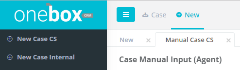
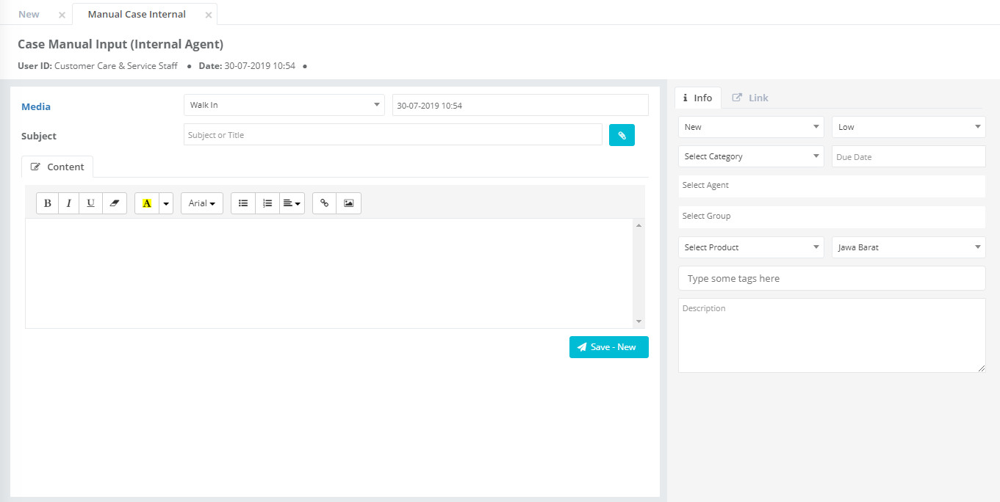
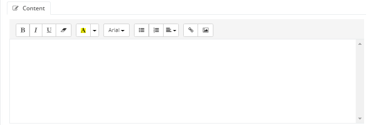
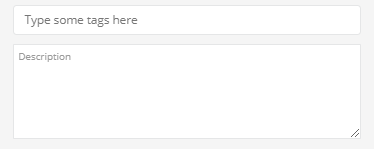

## Bagimana Cara Membuat Manual Input dari Internal/Penugasan Internal (New Case Internal)

1. Pilih Menu New lalu pilih sub menu New Case Internal

2. Pilih Media
3. Pilih tanggal message dibuat

4. Isi subject

5. Klik icon attachment jika ingin menambahkan lampiran (jika diperlukan)

6. Ketikkan detail pesan

7. Pilih status
8. Pilih prioritas
9. Pilih kategori
10. Pilih Due Date

11. Pilih PIC
12. Pilih Team/Group
13. Pilih Produk
14. Pilih Lokasi

15. Isi Tag
16. Isi Description

17. Klik Save -- New

