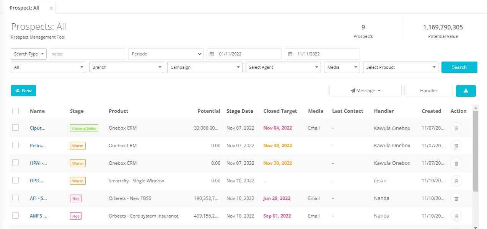
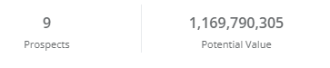
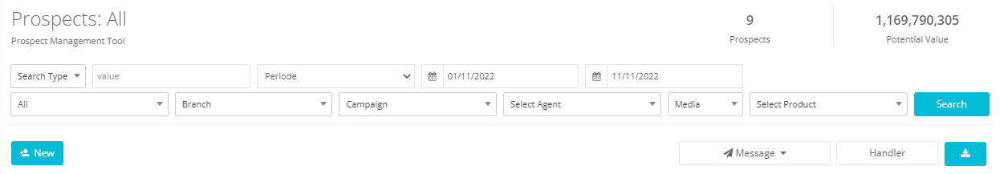

### List Prospect menapilkan informasi

- Total Prospect : Informasi yang menampilkan jumlah prospect berdasarkan filter yang dipilih
- Total Potential Value : Informasi yang menampilkan total potential value berdasarkan filter yang

### Filter Prospect

| No. | Type                                                 |     | Description                                                                                                                                          |
| --- | ---------------------------------------------------- | --- | ---------------------------------------------------------------------------------------------------------------------------------------------------- |
| 1.  | Combobox “Search Type”                               | :   | Berisi opsi/pilihan untuk pencarian, terdiri dari : Prospect Name dan Potential value                                                                |
| 2.  | Textbox value                                        | :   | Digunakan untuk nama prospek atau nilai potential value yang ingin dicari (sesuai dengan opsi/pilihan pencarian pada combobox “search type”)         |
| 3.  | Pencarian berdasarkan Periode Tanggal Catat Prospect | :   | Berisi pilihan periode untuk menampilkan data prospek berdasarkan periode yang dipilih, terdiri dari : today/week/month/period                       |
| 4.  | Tanggal                                              | :   | Tanggal awal data yang ingin dicari                                                                                                                  |
| 5.  | Tanggal                                              | :   | Tanggal akhir data yang ingin dicari                                                                                                                 |
| 6.  | Pencarian berdasarkan Status/stage prospect          | :   | Berisi pilihan status prospek untuk menampilkan data prospek berdasarkan status/stage yang dipilih, teridiri dari : all/cold/ warm/hot/closing sales |
| 7.  | Pencarian berdasarkan Branch                         | :   | Berisi list Branch/kantor cabang                                                                                                                     |
| 8.  | Pencarian berdasarkan Campaign                       | :   | TBerisi list campaign yang                                                                                                                           |
| 9.  | Select Agent                                         | :   | Berisi list PIC atau penanggungjawab prospek                                                                                                         |
| 10. | Pencarian berdasarkan Media                          | :   | Berisi pilihan Media untuk menampilkan prospek-prospek yang memiliki media berdasarkan media yg dipilih                                              |
| 11. | Pencarian berdasarkan Produk                         | :   | Berisi pilihan produk untuk menampilkan data prospek berdasarkan produk yang dipilih                                                                 |
| 12. | Tombol Search                                        | :   | Tombol untuk memproses pencarian berdasarkan item yang dipilih di atas                                                                               |
