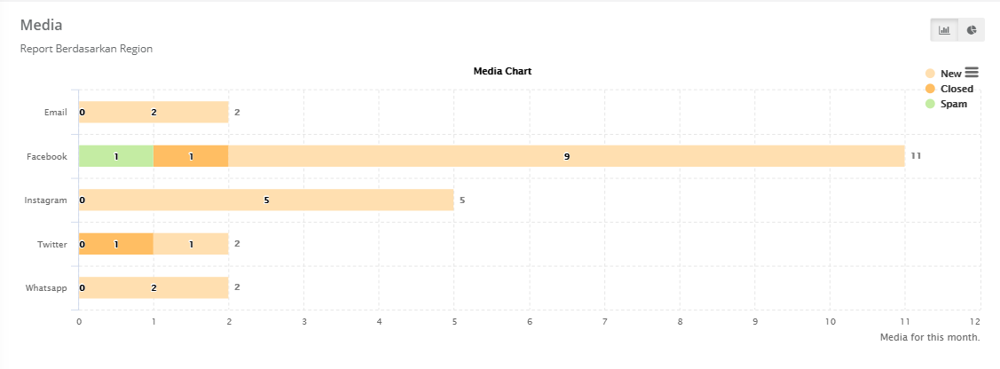

## Mapping Case Number by Category

Grafik (diagram batang atau pie) yang menggambarkan case berdasarkan kategori pada periode yang telah dipilih sesuai filter periode.

---

## Mapping Case Number by Product

Grafik (diagram batang atau pie) yang menggambarkan case berdasarkan produk pada periode
yang telah dipilih sesuai filter periode.

---

## Mapping Case Number by Agent

Grafik (diagram batang atau pie) yang menggambarkan case berdasarkan user/agent pada
periode yang telah dipilih sesuai filter periode.

---

## Mapping Case Number by Region

Grafik (diagram batang atau pie) yang menggambarkan case berdasarkan region/wilayah pada
periode yang telah dipilih sesuai filter periode.

---

## Mapping Case Number by Media

Grafik (diagram batang atau pie) yang menggambarkan rekap case berdasarkan channel/media
pada periode yang telah dipilih sesuai filter periode.

---

## Mapping Case Number by Priority

Grafik (diagram batang atau pie) yang menggambarkan case berdasarkan prioritas pada periode yang telah dipilih sesuai filter periode.

---

## Mapping Case Number by Team

Grafik (diagram batang atau pie) yang menggambarkan case berdasarkan team pada periode yang telah dipilih sesuai filter periode.

---

## Mapping Case Number by Overdue

Grafik (diagram batang atau pie) yang menggambarkan case berdasarkan overdue atau not overdue pada periode yang telah dipilih sesuai filter periode.

---
