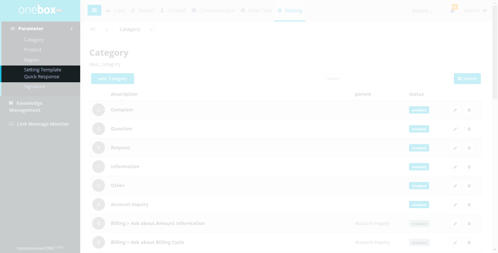
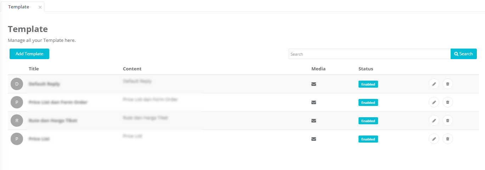
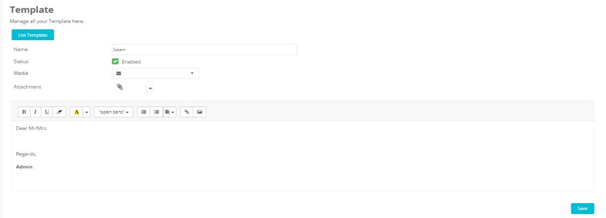
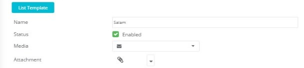
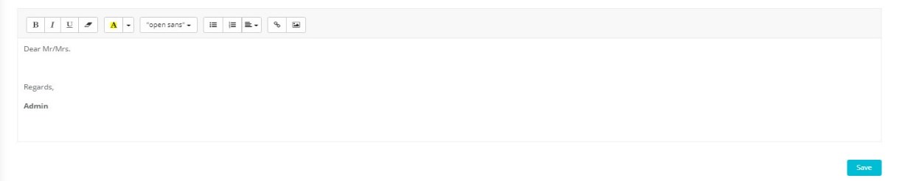

Sub menu Template digunakan untuk mengelola data template quick response. Item template ini ditampilkan pada combobox quick response di halaman Case Detail.

Menu : **Settings -> Parameter -> Template**

## List Template

Menampilkan list nama Template Quick Response dan aksi yang dapat dilakukan yaitu tambah, ubah atau hapus template.

Fungsi dan fitur yang terdapat pada halaman ini yaitu Pencarian, Add Template, Edit Template, Delete Template

Menu : **Settings -> Parameter -> Template**

1. **Add Template** : Untuk menambahkan data template
2. **Textbox Search** :
   Ketikkan nama template yang ingin dicari.
3. **Search** :
   Klik untuk menampilkan hasil pencarian.
   
4. **Title** : Judul template.
5. **Content** : Penggalan isi template
6. **Media** : Rekomendasi media untuk template tersebut
7. **Status** : Info status untuk ditampilkan(enabled) atau tidak(disabled) di case
   
8.  : Untuk menghapus template.
9.  : Untuk mengubah data template.

## Cara Menambahkan, Mengubah atau Menghapus Template

- Cara menambahkan Template: **Settings -> Parameter -> Template -> Add Template**
- Cara mengubah Template: **Settings -> Parameter -> Template -> (Icon Edit Template)**
- Cara menghapus Template: **Settings -> Parameter -> Template -> (Icon Delete Template)**

1. **List Template** : Untuk kembali ke halaman list template
2. **Name** : Input nama template(quick response)
3. **Status** : Ceklist(enabled) jika ingin mengaktifkan template ini, unceklist(disabled) untuk menyembunyikan template ini dari list quick response yang ada di halaman case detail
4. **Media** : Pilih media yang direkomendasikan untuk template tersebut
5. **Attachment** : Upload file yang dilampirkan di template tersebut
   
6. **Content** : Isi pesan(body message)
7. **Save** : Untuk menyimpan data template yang telah diisi tersebut
   
