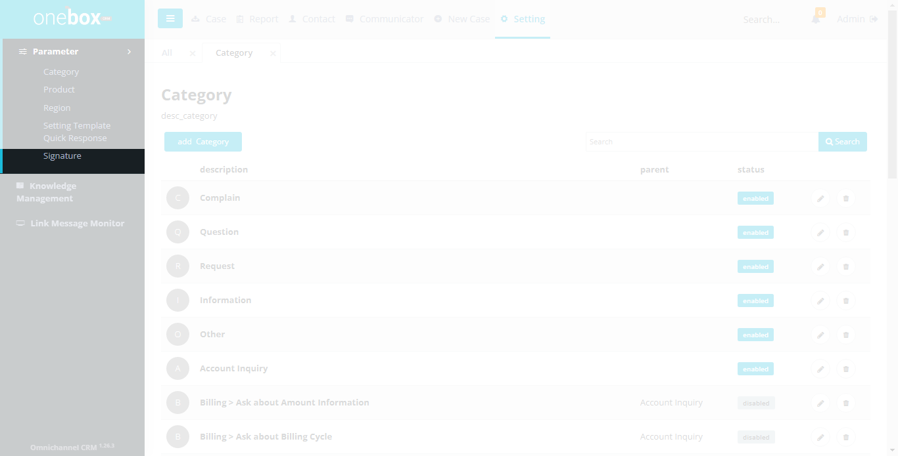
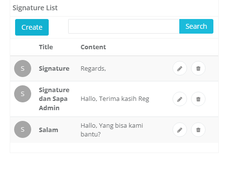
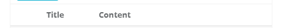
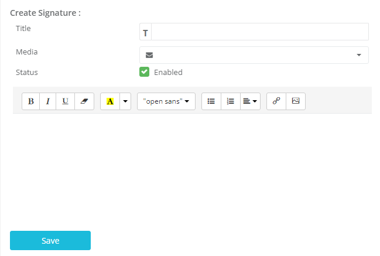
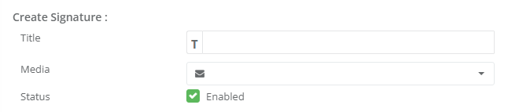
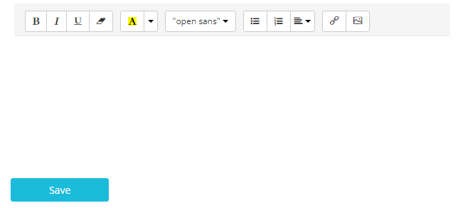

Sub menu Signature digunakan untuk mengelola data signature quick response. Item signature ini ditampilkan pada combobox quick response di halaman Case Detail.

Menu : **Settings -> Parameter -> Signature**

## List Signature

Menampilkan list nama Signature Quick Response dan aksi yang dapat dilakukan yaitu tambah, ubah atau hapus Signature.

Fungsi dan fitur yang terdapat pada halaman ini yaitu Pencarian, Add Signature, Edit Template, Delete Signature

Menu : **Settings -> Parameter -> Signature**

1. **Create** : Untuk membuat data signature
2. **Textbox Search** :
   Ketikkan nama signature yang ingin dicari.
3. **Search** :
   Klik untuk menampilkan hasil pencarian.
   
4. **Title** : Judul signature.
5. **Content** : Penggalan isi signature 
   
6.  : Untuk menghapus signature.
7.  : Untuk mengubah data signature.

## Cara Menambahkan, Mengubah atau Menghapus Signature

- Cara menambahkan Signature: **Settings -> Parameter -> Signature -> Create**
- Cara mengubah Signature: **Settings -> Parameter -> Signature -> (Icon Edit Signature)**
- Cara menghapus Signature: **Settings -> Parameter -> Signature -> (Icon Delete Signature)**

1. **Title** : Input title signature
2. **Media** : Pilih media yang direkomendasikan untuk template tersebut
3. **Status** : Ceklist(enabled) jika ingin mengaktifkan template ini, unceklist(disabled) untuk menyembunyikan template ini dari list quick response yang ada di halaman case detail
   
4. **Content** : Isi pesan(body message)
5. **Save** : Untuk menyimpan data template yang telah diisi tersebut
   
