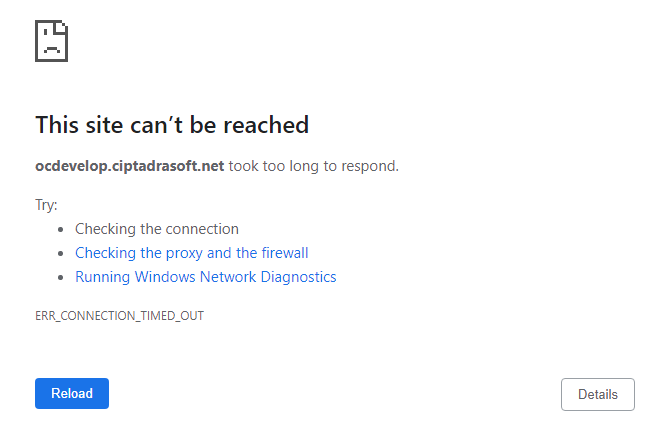
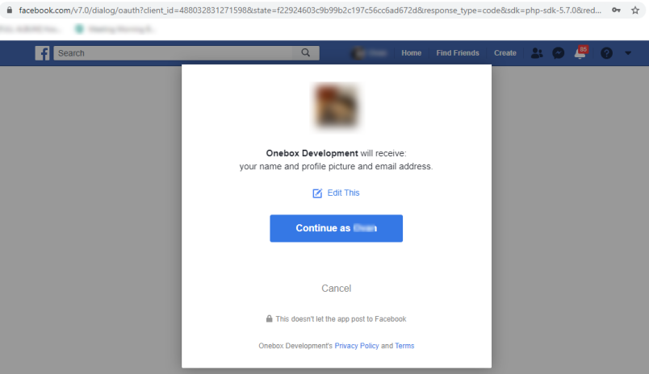
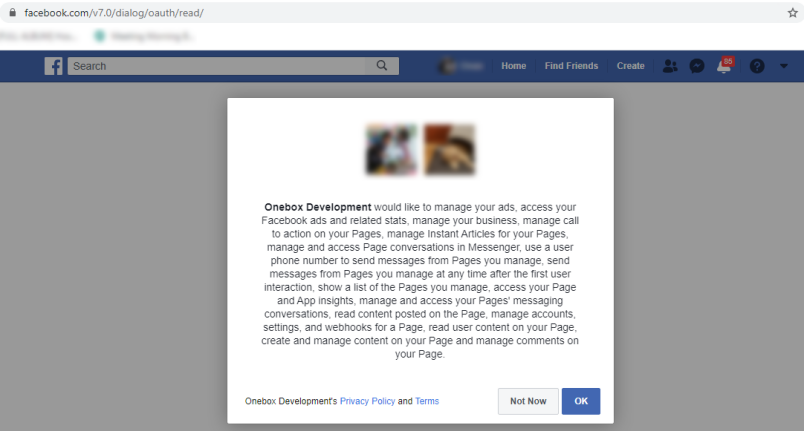

## Authentication Facebook

The token API is used to create tokens for one site. This token will later be used as a mandatory parameter for Facebook Credential API (Get facebook Auth session).

The token will expire within a certain period. Re-generate token if it has expired.

### Data

|         |     |                                                                                                          |
| ------- | --- | -------------------------------------------------------------------------------------------------------- |
| Method  | :   | GET                                                                                                      |
| URL     | :   | {hostAPI}/facebook/auth?redirectUrl={hostSite}/facebook/session                                          |
| Example | :   | https://ocdev.ciptadrasoft.net/facebook/auth?redirectUrl=https://ocdev.ciptadrasoft.net/facebook/session |
| Return  | :   | `{hostSite}/facebook/session?sessionId={session-id}#_=_`                                                 |

### Parameter

|     Key      |                                                 Value                                                  |                                                           Description                                                            |
| :----------: | :----------------------------------------------------------------------------------------------------: | :------------------------------------------------------------------------------------------------------------------------------: |
|  {hostAPI}   |                                         ocdev.ciptadrasoft.net                                         |  host of API<br/> - “ocdev.ciptadrasoft.net” for environment development<br/> - “cloud.onebox.co.id” for environment production  |
|  {hostSite}  |                                         ocdev.ciptadrasoft.net                                         | host of site<br/> - “ocdev.ciptadrasoft.net” for environment development<br/> - “mysite.onebox.co.id” for environment production |
| {session-id} | WmNOWEhETmFhbmFTNWljWld0NmlU<br/>bWRVK1AvUXk4M0tuSm9NSkVGZW5<br/>VOD06TGpnU3BrWlFuZVJoai9UdjgreGRiZz09 |                                    Auth Session Id, see Onebox Auth API Implementation Guide                                     |

### Response

1. Wrong site url

   

   |         |     |                                                                                                                  |
   | ------- | --- | ---------------------------------------------------------------------------------------------------------------- |
   | Example | :   | https://ocdevelop.ciptadrasoft.net/facebook/auth?redirectUrl=https://ocdevelop.ciptadrasoft.net/facebook/session |

1. Success Authenticate Facebook

   

   

   |                  |     |                                                                                                          |
   | ---------------- | --- | -------------------------------------------------------------------------------------------------------- |
   | try again access | :   | https://ocdev.ciptadrasoft.net/facebook/auth?redirectUrl=https://ocdev.ciptadrasoft.net/facebook/session |

   |                                   |     |                                                                                                                                                              |
   | --------------------------------- | --- | ------------------------------------------------------------------------------------------------------------------------------------------------------------ |
   | Session will show in url, example | :   | `https://ocdev.ciptadrasoft.net/facebook/session?sessionId=WmNOWEhETmFhbmFTNWljWld0NmlUbWRVK1AvUXk4M0tuSm9NSkVGZW5VOD06TGpnU3BrWlFuZVJoai9UdjgreGRiZz09#_=_` |

---

## Get Session

API to get latest Facebook authentication and authorization result

### Data

|         |     |                                                                                                                                                  |
| ------- | --- | ------------------------------------------------------------------------------------------------------------------------------------------------ |
| Method  | :   | GET                                                                                                                                              |
| URL     | :   | {host}/api/facebook/session/{session-id}                                                                                                         |
| Example | :   | https://ocdev.ciptadrasoft.net/api/facebook/session/WmNOWEhETmFhbmFTNWljWld0NmlUbWRVK1AvUXk4M0tuSm9NSkVGZW5VOD06TGpnU3BrWlFuZVJoai9UdjgreGRiZz09 |
| Return  | :   | JSON                                                                                                                                             |

### Header

|      Key      |     Value      |                                      Description                                      |
| :-----------: | :------------: | :-----------------------------------------------------------------------------------: |
| Authorization | Bearer {token} | This token be used as a mandatory parameter for each API, obtained from the token API |

### Parameter

|     Key      |                                                 Value                                                  |                        Description                        |
| :----------: | :----------------------------------------------------------------------------------------------------: | :-------------------------------------------------------: |
| {session-id} | WmNOWEhETmFhbmFTNWljWld0NmlUbWRVK1A<br/>vUXk4M0tuSm9NSkVGZW5VOD06TGpnU3Br<br/>WlFuZVJoai9UdjgreGRiZz09 | Auth Session Id, see Onebox Auth API Implementation Guide |

### Response

1. **Code 401**

    <details><summary>Expired token</summary><p>

   ```jsx title="Body"
   {
   	"_meta": {
   			"status": "ERROR",
   			"count": 1
   	},
   	"records": {
   			"errorCode": 401,
   			"userMessage": "Expired token",
   			"devMessage": null,
   			"more": null,
   			"applicationCode": null
   	}
   }
   ```

  </p></details>

2. **Code 401**

    <details><summary>Over limit quota</summary><p>

   ```jsx title="Body"
   {
   	"_meta": {
   			"status": "ERROR",
   			"count": 1
   	},
   	"records": {
   			"errorCode": 401,
               "userMessage": "time limit reached please try again tomorrow at 18:00 - 06:00",
               "devMessage": "",
   			"more": null,
   			"applicationCode": ""
   	}
   }
   ```

  </p></details>

3. **Code 200**

    <details><summary>Success</summary><p>

   ```jsx title="Body"
   {
    "session": "ZcNXHDNaanaS5icZWt6iTmdU+P/Qy83KnJoMJEFenU8=:LjgSpkZQneRhj/Tv8+xdbg==",
    "profile": {
        "name": "Ovan Donnovan",
        "id": "508654789659284"
    },
    "token": "EAAG73PZBL8q4BAIzyLyyosNOPZCvKZA0vg26OYBwcxfOB8r6pmOJNC1yZANxeCyUV8fbqdopawL4qdgunkX5getXYqI1ZCZAueJf21vh6B40qJ1iFL0nxrpnlaHklZBFplDbKZAnGRWUSiPwHfSb6CnFXUSbX8NxY0nOmIb7BPZC8HwZDZD",
    "accounts": [
       {
            "access_token": "EAAG73PZBL8q4BAIEIfmtwp2FRA38K0UvvpNePHRQGrD4rquLtVV4suAyXW0Ad17CdhQpQxWtTZB4PhiAOeMAXRV1Gzorrr8s5LhdBiZCFZA6lyFkmmUZCM1oDWnnFIvJI2obpIhPd8FRSYbQkGoOSBgqioPVq0aTBSSucZABqFfk1rVw4LtRCN",
            "category": "Clothing (Brand)",
            "category_list": [
                {
                    "id": "2209",
                    "name": "Clothing (Brand)"
                }
            ],
            "name": "Jamku",
            "id": "1903864646522191",
            "tasks": [
                "ANALYZE",
                "ADVERTISE",
                "MODERATE",
                "CREATE_CONTENT",
                "MANAGE"
            ]
        }
    ]
   }
   ```

  </p></details>
