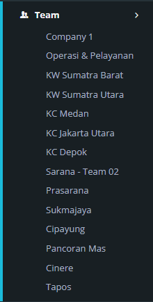

---

## Menu Utama

Menu utama case. Menu Case memiliki sub menu yang dapat digunakan user untuk melihat kumpulan case berdasarkan sub menu yang dipilih.

---

## Sub Menu Status

Untuk menampilkan daftar case berdasarkan status yang dipilih. Sub status dari sub menu Status adalah:

1. **All** : Menampilkan semua case yang statusnya belum selesai (New, Open, Pending)
1. **New** : Menampilkan semua case yang statusnya New (Baru)
1. **Open** : Menampilkan semua case yang statusnya Open
1. **Pending** : Menampilkan semua case yang statusnya Pending
1. **Solve** : Menampilkan semua case yang statusnya Solve
1. **Close** : Menampilkan semua case yang statusnya Close

---

## Sub Menu Media

Untuk menampilkan daftar case berdasarkan media. Priority terdiri dari : Chats, Sosial Media dan Others.

---

## Sub Menu Category

Untuk menampilkan daftar case berdasarkan induk kategori/klasifikasi yang dipilih. Case per kategori/klasifikasi yang ditampilkan adalah yang berstatus New, Open, Pending dan Solve.

---

## Sub Menu Priority

Untuk menampilkan daftar case berdasarkan prioritas. Priority terdiri dari : Low, Medium dan High. Case per priority yang ditampilkan adalah yang berstatus New, Open, Pending dan Solve.

---

## Sub Menu Team

Untuk menampilkan daftar case berdasarkan Team. Team yang ditampilkan adalah team yang beranggotakan agent tersebut. Case per team yang ditampilkan adalah yang berstatus New, Open, Pending dan Solve.

---
