Broadcast adalah modul yang digunakan untuk melakukan pengiriman data, ke beberapa pelanggan

1. Broadcast List Broadcast list menampilkan list campaign/broadcast data yang sedang dilakukan dan sudah selesai dilakukan broadcast.
1. Add New Campaign

   

   Add New Campaign digunakan untuk membuat campaign/broadcast baru.

---

## Broadcast List

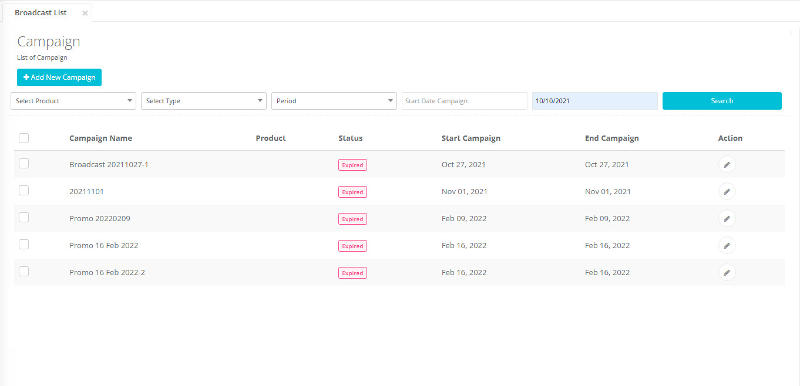

1. Informasi Campaign name
1. Informasi Produk
1. Informasi Prioritas
1. Informasi Start campaign
1. Informasi End campaign

---

## Filter Pada Broadcast List

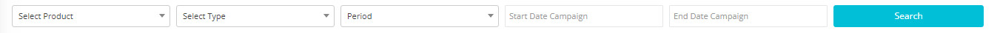

Filter yang terdapat pada Broadcast List yaitu :

1. **Periode**: untuk menampilkan data berdasarkan periode yang dipilih yang terdiri dari Today, Weekly, Monthly dan Periode.
1. **Start date Campaign** : untuk menampilkan daftar campaign berdasarkan tanggal awal/start date yang dipilih
1. **End date Campaign** : untuk menampilkan daftar campaign berdasarkan start date yang dipilih hingga end date.

---

## Bagaimana Mengisi Data Parameter pada Excel Upload Broadcast (Dynamic Parameter)?

Hal yang perlu diperhatikan :

1. Cek template/Quick Response (QR) yang akan digunakan 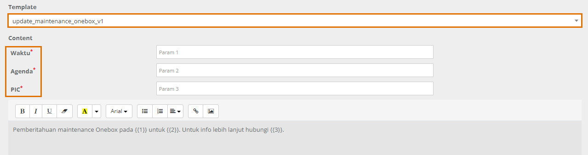
1. Cek Nama parameter pada template/Quick Response (QR) yang akan digunakan. Berdasarkan contoh di atas maka nama parameternya adalah waktu, agenda dan pic 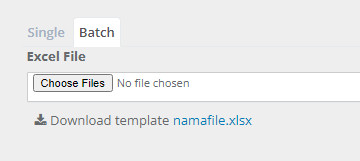
1. Default template dapat di download dari Tahap Recipient saat Add New Broadcast : 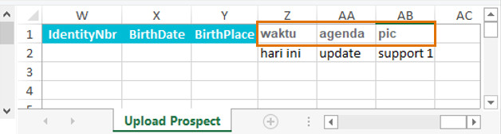
1. Tambahkan kolom pada excel. Isi Nama Kolom dengan nama parameter yang ada pada template Berdasarkan contoh di atas maka nama kolom yang ditambahkan adalah waktu, agenda dan pic
1. Penting! Perhatikan penulisan nama parameter pada judul kolom :

   - huruf capital / non kapital
   - spasi
   - dll Pastikan sama dengan nama parameter yang ada pada template (QR). Kesalahan penulisan akan mengakibatkan parameter tidak terbaca! 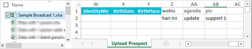

1. Contoh file broadcast: Contoh pesan yang akan diterima: 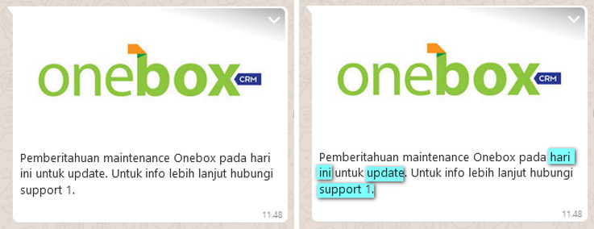

---

## Bagaimana Cara Membuat (Create) Broadcast?

1. Klik tombol “Add New Campaign”

   

   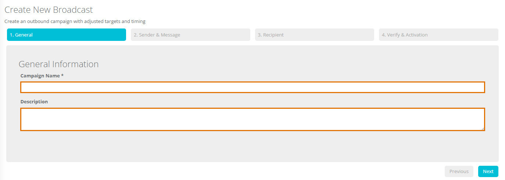

1. Input Campaign Name
1. Input Description untuk mengisi deskripsi terkait campaign/broadcast.
1. Klik “Next”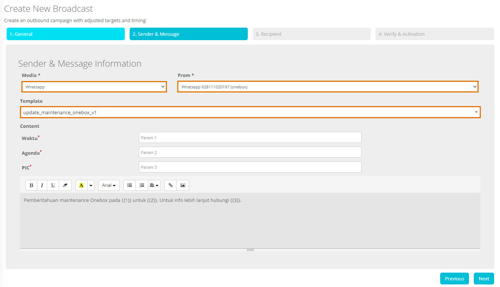
1. Pilih channel yang digunakan untuk melakukan broadcast pada combobox media
1. Pilih akun yang digunakan pada combobox from
1. Pilih template yang akan digunakan untuk melakukan blast Abaikan pengisian data parameter karena data parameter diisi pada file upload excel.
1. Klik “Next” untuk melanjutkan ke tahap berikutnya.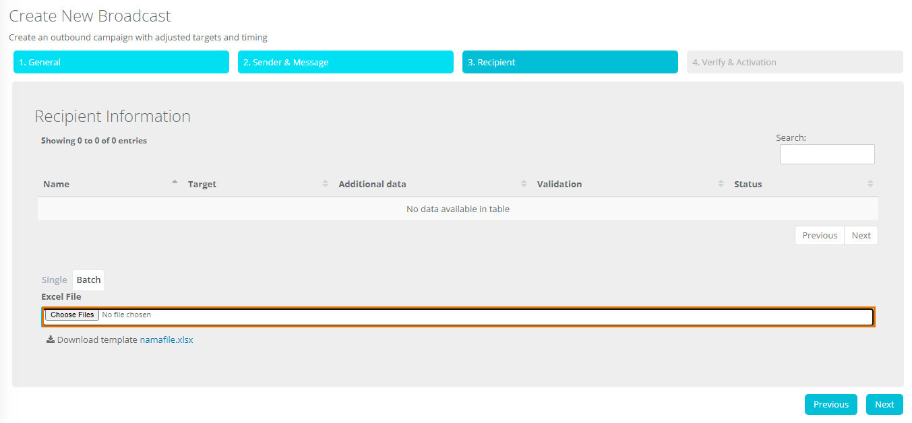
1. Klik Choose File yang digunakan untuk import data
1. Upload file yang telah disiapkan. Template file dapat didownload dengan cara klik <code>**namafile.xlsx**</code>. Penjelasan untuk pengisian data, dapat dilihat di sub bab: <a href="#bagaimana-mengisi-data-parameter-pada-excel-upload-broadcast-dynamic-parameter">Bagaimana Mengisi Data Parameter pada Excel Upload Broadcast (Dynamic Parameter)?</a>
1. Klik Next
1. Klik “Submit” jika data sudah sesuai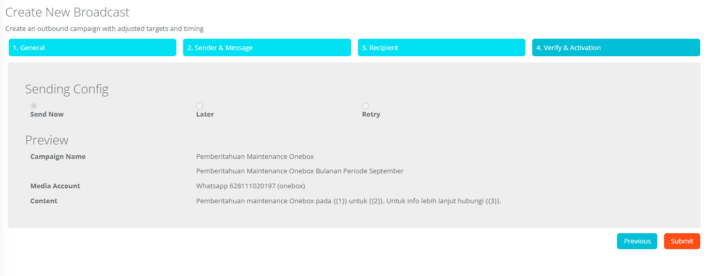
1. Klik “Yes, process it”

   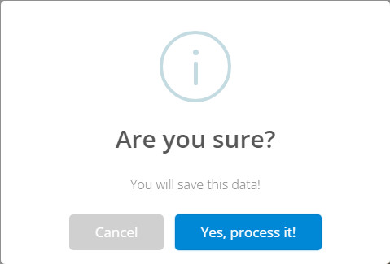

1. Tunggu hingga process berhasil lalu klik “OK”
   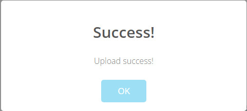
1. Menampilkan informasi data terkait broadcast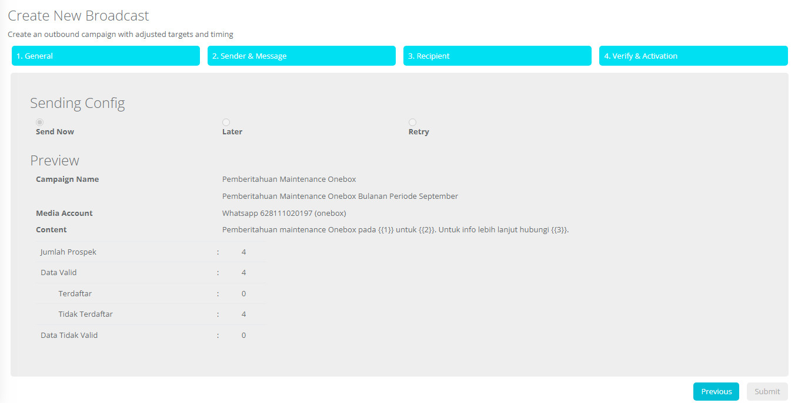
1. Penjelasan Preview Campaign pada tahap Verify & Activation
   - Campaign Name : Nama campaign/broadcast yang akan digunakan untuk melakukan blast.
   - Media Account : Media yang digunakan untuk melakukan broadcast campaign.
   - Content : Isi dari pesan yang akan di blast.
   - Jumlah prospect : Total dari semua pelanggan yang terdaftar dalam broadcast tersebut.
   - Data valid : Total data sesuai/valid berdasarkan data excel
   - Data tidak valid : Total data tidak sesuai/invalid berdasarkan data excel
   - Tidak Terdaftar : Total data yang tidak terdapat pada data kontak.
   - Terdaftar : Total data yang terdaftar pada data kontak
1. Penjelasan Recipient Informasi
   - Name : Nama target blast
   - Target : Nomor tujuan blast
   - Validation : Info data yang di broadcast valid atau invalid

---

## Cara Melihat Broadcast Detail

1. Klik menu Prospect > Broadcast
1. Klik action pada broadcast yang akan di view, akan tampil info terkait broadcast yang dipilih tersebut

---

## Fitur View Broadcast Detail

1. Tampilan Tahap Info General Campaign/Broadcast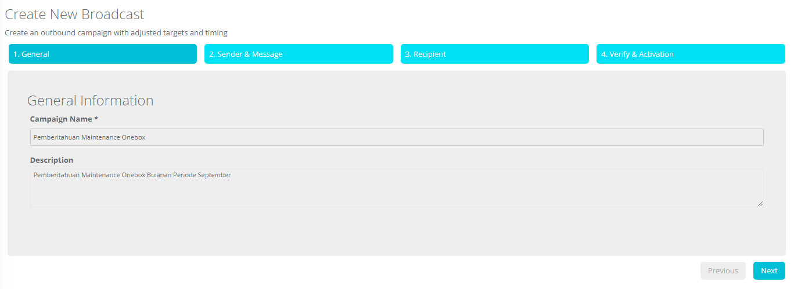

1. Tampilan Tahap Info Sender & Message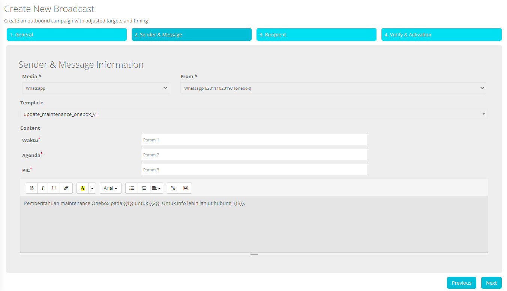

1. Tampilan Tahap Info Recipient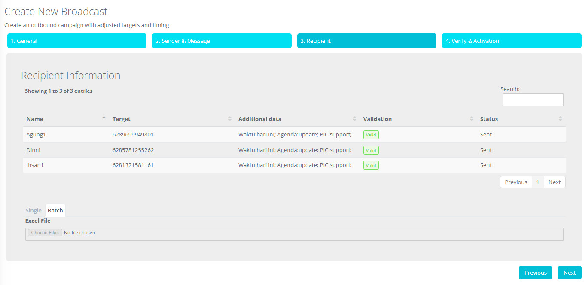

1. Tampilan Tahap Verify & Activation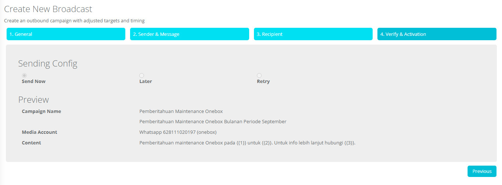
