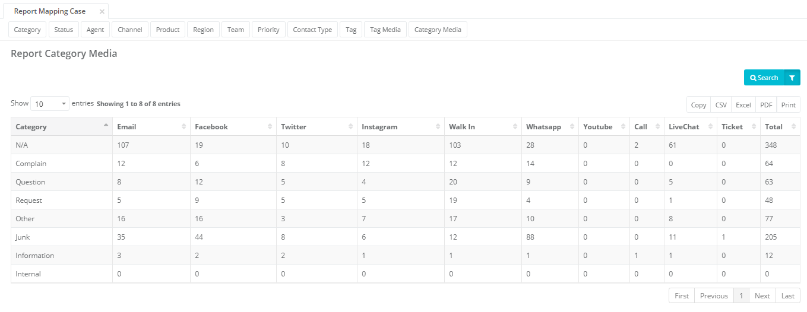

## Mapping Case Number by Category

Mapping Case by Category berisi rekap case berdasarkan kategori pada periode yang telah
dipilih sesuai filter periode.

---

## Mapping Case Number by Status

Mapping Case by Status berisi rekap case berdasarkan status pada periode yang telah dipilih sesuai filter periode.

---

## Mapping Case Number by Agent

Mapping Case by Agent berisi rekap case berdasarkan user/agent pada periode yang telah dipilih sesuai filter periode.

---

## Mapping Case Number by Channel

Mapping Case by Channel berisi rekap case berdasarkan channel/media pada periode yang telah dipilih sesuai filter periode.

---

## Mapping Case Number by Product

Mapping Case by Product berisi rekap case berdasarkan produk pada periode yang telah dipilih sesuai filter periode.

---

## Mapping Case Number by Region

Mapping Case by Region berisi rekap case berdasarkan region/wilayah pada periode yang telah dipilih sesuai filter periode.

---

## Mapping Case Number by Team

Mapping Case by Team berisi rekap case berdasarkan team pada periode yang telah dipilih sesuai filter periode.

---

## Mapping Case Number by Priority

Mapping Case by Priority berisi rekap case berdasarkan prioritas pada periode yang telah dipilih sesuai filter periode.

---

## Mapping Case Number by Contact Type

Mapping Case by Contact type berisi rekap case berdasarkan tipe kontak pada periode yang telah dipilih sesuai filter periode.

---

## Mapping Case Number by Tag

Mapping Case by Tag berisi rekap case berdasarkan tag pada periode yang telah dipilih sesuai filter periode.

---

## Mapping Case Number by Tag Media

Mapping Case by Tag Media berisi rekap case berdasarkan mapping antara tag dengan media/channel pada periode yang telah dipilih sesuai filter periode.

---

## Mapping Case Number by Category Media

Mapping Case by Category Media berisi rekap case berdasarkan mapping antara kategori dengan media pada periode yang telah dipilih sesuai filter periode.

