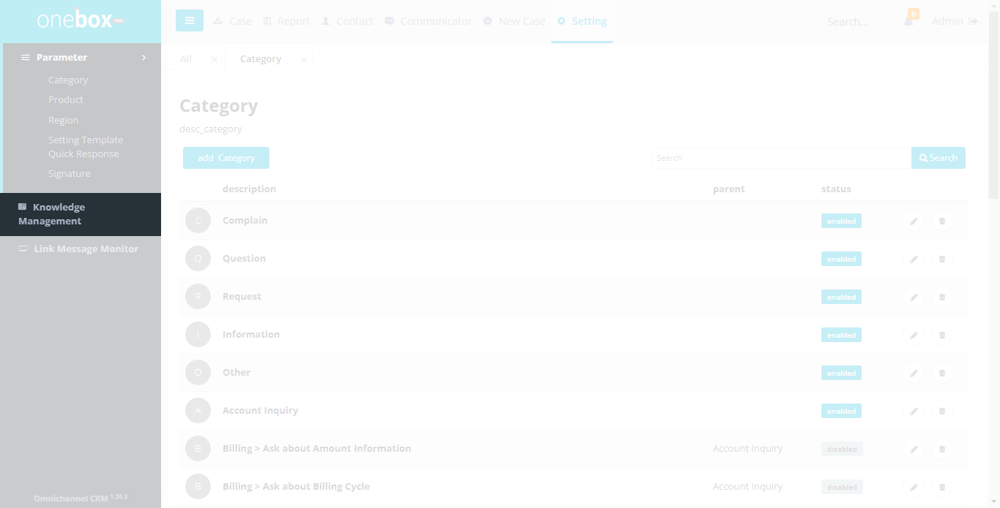
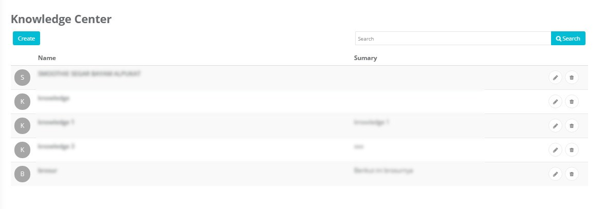
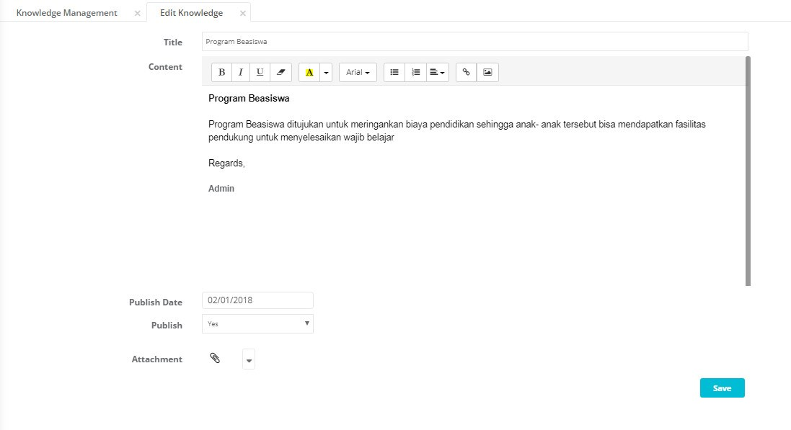
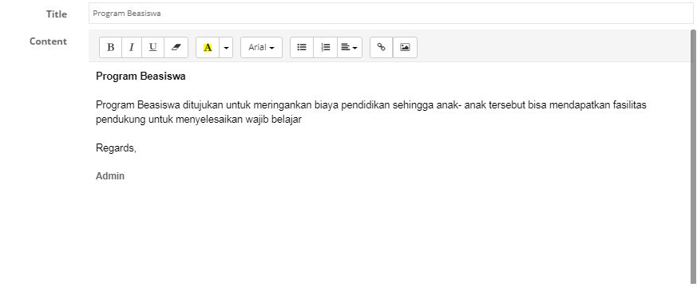
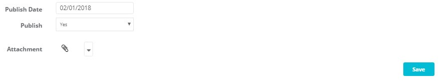

Sub menu Knowledge digunakan untuk mengelola data knowledge. Item knowledge ini tersedian di menu atas (disamping user logout).

Menu : **Settings -> Knowledge**

## List Knowledge

Menampilkan list nama knowledge dan aksi yang dapat dilakukan yaitu tambah, ubah atau hapus knowledge.

Fungsi dan fitur yang terdapat pada halaman ini yaitu Pencarian, Add Knowledge, Edit Knowledge, Delete Knowledge

Menu : **Settings -> Knowledge**

1. **Create** : Untuk menambahkan data Knowledge
2. **Search** :
   Untuk mencari Knowledge berdasarkan title (nama Knowledge)
   
3. **Name** : Judul Knowledge.
4. **Summary** : Penggalan isi knowledge
   
5.  : Untuk menghapus Knowledge.
6.  : Untuk mengubah data Knowledge.

## Cara Menambahkan, Mengubah atau Menghapus Knowledge

- Cara menambahkan produk : **Settings -> Knowledge -> Create**
- Cara mengubah produk : **Settings -> Knowledge -> (Icon Edit Knowledge)**
- Cara menghapus produk : **Settings -> Knowledge -> (Icon Delete Knowledge)**

1. **Name** : Input nama knowledge
2. **Content** : Isi knowledge(body message)
   
3. **Publish Date** : Tanggal publish knowledge
4. **Publish** : Yes jika ingin mengaktifkan knowledge ini, No untuk menginfokan knowlege tersebut tidak aktif
5. **Attachment** : Upload file yang dilampirkan di knowledge tersebut
6. **Save** : Untuk menyimpan data knowledge yang telah diisi
   
