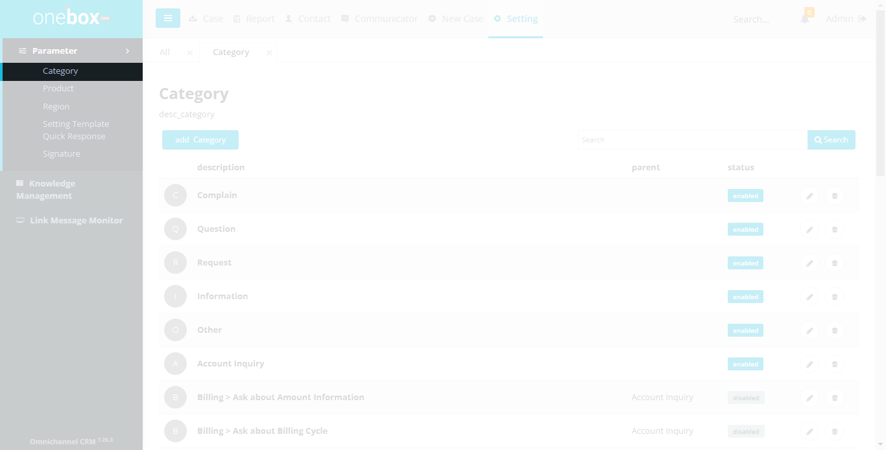
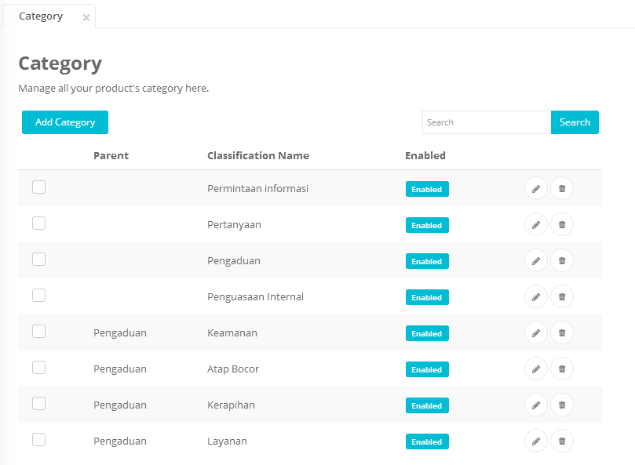
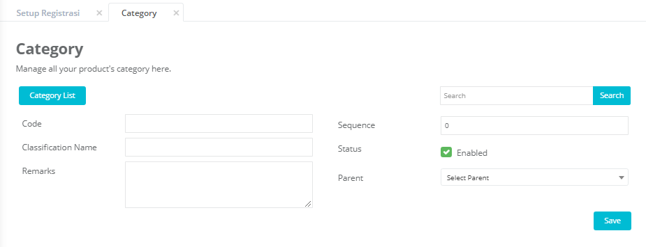
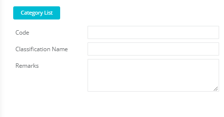
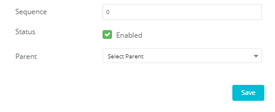

Sub menu Category digunakan untuk mengelola data kategori. Item kategori ini ditampilkan pada combobox kategori di halaman Case Detail atau saat input manual case.

Menu : **Settings -> Parameter -> Category**

## List Kategori

Menampilkan list kategori yang berisi data kategori yaitu: parent(induk), Classification Name Enable

Fungsi dan fitur yang terdapat pada halaman ini yaitu Pencarian, Add Category, Edit Category, Delete Category

1. **Textbox Search** :
   Ketikkan nama klasifikasi yang ingin dicari.
2. **Search** :
   Klik untuk menampilkan hasil pencarian
3. **Add Category** :
   Klik untuk menambahkan kategori, maka akan menampilkan halaman input data kategori (penjelasan di “Cara Menambahkan Kategori”)
   
4.  :
   Icon **Edit Category** untuk mengubah data kategori: Klik untuk mengubah data kategori, maka akan menampilkan halaman data kategori yang dipilih untuk diubah (penjelasan di “Cara Mengubah Kategori”)
5.  :
   Icon **Delete Category** untuk menghapus data kategori: Klik untuk menghapus data kategori
6. **Nama Parent** :
   (induk) dari klasifikasi
7. **Classification Name** :
   Nama Klasifikasi atau nama kategori
8. **Enable/Disable** : a. Enable : Klasifikasi yang akan ditampilkan di combobox category pada halaman case detail b. Disable : Klasifikasi yang tidak akan ditampilkan di combobox category pada halaman case detail
   

## Cara Menambahkan, Mengubah atau Menghapus Kategori

- Cara menambahkan kategori : **Settings -> Parameter -> Category -> Add Category**
- Cara mengubah kategori : **Settings -> Parameter -> Category -> (Icon Edit Category)**
- Cara menghapus kategori : **Settings -> Parameter -> Category -> (Icon Delete Category)**

1. **Category List** : Untuk kembali ke halaman list kategori
2. **Code** : Input ID untuk kategori tersebut
3. **Classification Name** : Input Nama klasifikasi. Nama klasifikasi ini yang akan tampil di combobox classification
4. **Remarks** : Dapat diisi penjelasan/keterangan lain yang terkait dengan klasifikasi tersebut
   
5. **Sequence** : Urutan yang ingin ditampilkan di combobox classification
6. **Status** : Ceklist enable jika ingin ditampilkan di combobox, unceklist jika tidak ingin ditampilkan namun masih
7. **Parent** : Memilih induk dari kategori yang diinput. Memilih “Select Parent” jika ingin dijadikan induk (tidak memiliki induk).
8. **Save** : Untuk menyimpan data, lalu menampilkan list kategori
   
