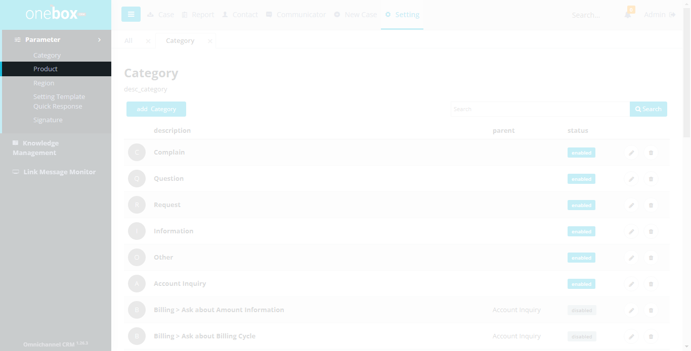
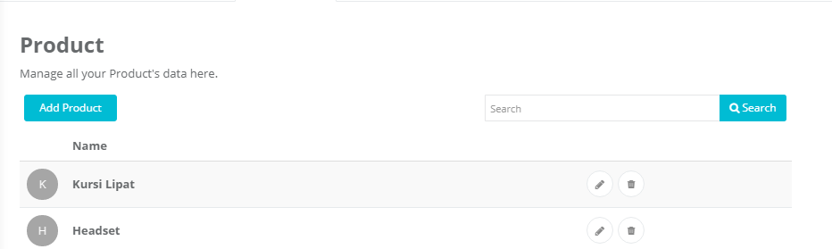
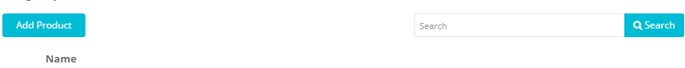
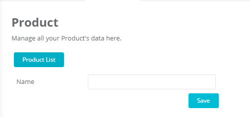

Sub menu Product digunakan untuk mengelola data produk. Item produk ini ditampilkan pada combobox product di halaman Case Detail atau saat input manual case.

Menu : **Settings -> Parameter -> Product**

## List Produk

Menampilkan list nama produk dan aksi yang dapat dilakukan yaitu tambah, ubah atau hapus produk.

Fungsi dan fitur yang terdapat pada halaman ini yaitu Pencarian, Add product, Edit Product, Delete Product

Menu : **Settings -> Parameter -> Product**

1. **Add Product** : Untuk menambahkan produk
2. **Textbox Search** :
   Ketikkan nama produk yang ingin dicari.
3. **Search** :
   Klik untuk menampilkan hasil pencarian
4. **Name** : Menampilkan nama produk
   
5.  : Untuk mengubah produk.
6.  : Untuk menghapus produk

## Cara Menambahkan, Mengubah atau Menghapus Produk

- Cara menambahkan produk : **Settings -> Parameter -> Product -> Add Product**
- Cara mengubah produk : **Settings -> Parameter -> Product -> (Icon Edit Product)**
- Cara menghapus produk : **Settings -> Parameter -> Product -> (Icon Delete Product)**

1. **Product** : List Untuk kembali ke halaman list produk.
2. **Name** : Input ID untuk produk tersebut
3. **Save** : Untuk menyimpan produk yang diinput.
