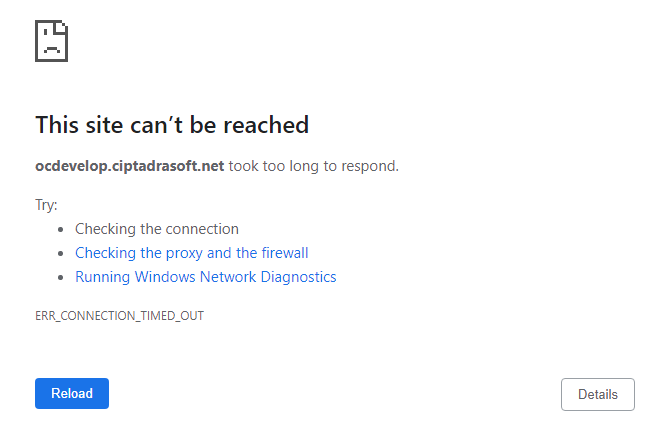

## Authentication Instagram

The token API is used to create tokens for one site. This token will later be used as a mandatory parameter for Instagram Credential API (Get Instagram Auth session).

The token will expire within a certain period. Re-generate token if it has expired.

### Data

|         |     |                                                                                                              |
| ------- | --- | ------------------------------------------------------------------------------------------------------------ |
| Method  | :   | GET                                                                                                          |
| URL     | :   | {host}/instagraph/auth?redirectUrl={host}/instagraph/session                                                 |
| Example | :   | https://ocdev.ciptadrasoft.net/instagraph/auth?redirectUrl=https://ocdev.ciptadrasoft.net/instagraph/session |
| Return  | :   | `{host}/instagraph/session?sessionId={session-id}#_=_`                                                       |

### Parameter

|     Key      |                                                 Value                                                  |                                                           Description                                                            |
| :----------: | :----------------------------------------------------------------------------------------------------: | :------------------------------------------------------------------------------------------------------------------------------: |
|  {hostAPI}   |                                         ocdev.ciptadrasoft.net                                         |  host of API<br/> - “ocdev.ciptadrasoft.net” for environment development<br/> - “cloud.onebox.co.id” for environment production  |
|  {hostSite}  |                                         ocdev.ciptadrasoft.net                                         | host of site<br/> - “ocdev.ciptadrasoft.net” for environment development<br/> - “mysite.onebox.co.id” for environment production |
| {session-id} | WmNOWEhETmFhbmFTNWljWld0NmlUbWRV<br/>K1AvUXk4M0tuSm9NSkVGZW5VOD06TGp<br/>nU3BrWlFuZVJoai9UdjgreGRiZz09 |                                    Auth Session Id, see Onebox Auth API Implementation Guide                                     |

### Response

1. Wrong site url

   

   |         |     |                                                                                                                      |
   | ------- | --- | -------------------------------------------------------------------------------------------------------------------- |
   | Example | :   | https://ocdevelop.ciptadrasoft.net/instagraph/auth?redirectUrl=https://ocdevelop.ciptadrasoft.net/instagraph/session |

1. Success Authenticate Facebook

   

   

   |                  |     |                                                                                                              |
   | ---------------- | --- | ------------------------------------------------------------------------------------------------------------ |
   | try again access | :   | https://ocdev.ciptadrasoft.net/instagraph/auth?redirectUrl=https://ocdev.ciptadrasoft.net/instagraph/session |

   |                                   |     |                                                                                                                                                                |
   | --------------------------------- | --- | -------------------------------------------------------------------------------------------------------------------------------------------------------------- |
   | Session will show in url, example | :   | `https://ocdev.ciptadrasoft.net/instagraph/session?sessionId=NldqYXA5UDBhREVkUzBnK1FvRHZsYmxySGhhRzBZNzdHOWVncG5vci8ycz06TENUQmRqdEI2azJqSmFhUDRQWFNGQT09#_=_` |

## Get Session

API to get latest Instagram authentication and authorization result

### Data

|         |     |                                                                                                                                          |
| ------- | --- | ---------------------------------------------------------------------------------------------------------------------------------------- |
| Method  | :   | GET                                                                                                                                      |
| URL     | :   | {host}/api/instagraph/session/{session-id}                                                                                               |
| Example | :   | https://ocdev.ciptadrasoft.net/api/session/ VEwvZjFSbzBXczNqME14OTltNUZzT0ZHa3AwNUZETE91QmNEOVFLbDU2UT06YjVBbEoyRFJzMWg2ekUxWTl5WHo1Zz09 |
| Return  | :   | JSON                                                                                                                                     |

### Header

|      Key      |     Value      |                                      Description                                      |
| :-----------: | :------------: | :-----------------------------------------------------------------------------------: |
| Authorization | Bearer {token} | This token be used as a mandatory parameter for each API, obtained from the token API |

### Parameter

|     Key      |                                                 Value                                                  |                        Description                        |
| :----------: | :----------------------------------------------------------------------------------------------------: | :-------------------------------------------------------: |
| {session-id} | VEwvZjFSbzBXczNqME14OTltNUZzT0ZHa3A<br/>wNUZETE91QmNEOVFLbDU2UT06YjVBbEoyR<br/>FJzMWg2ekUxWTl5WHo1Zz09 | Auth Session Id, see Onebox Auth API Implementation Guide |

### Response

1. **Code 401**

    <details><summary>Expired token</summary><p>

   ```jsx title="Body"
   {
   	"_meta": {
   			"status": "ERROR",
   			"count": 1
   	},
   	"records": {
   			"errorCode": 401,
   			"userMessage": "Expired token",
   			"devMessage": null,
   			"more": null,
   			"applicationCode": null
   	}
   }
   ```

  </p></details>

2. **Code 401**

    <details><summary>Over limit quota</summary><p>

   ```jsx title="Body"
   {
   	"_meta": {
   			"status": "ERROR",
   			"count": 1
   	},
   	"records": {
   			"errorCode": 401,
               "userMessage": "time limit reached please try again tomorrow at 18:00 - 06:00",
               "devMessage": "",
   			"more": null,
   			"applicationCode": ""
   	}
   }
   ```

  </p></details>

3. **Code 200**

    <details><summary>Success</summary><p>

   ```jsx title="Body"
   {
    "session": "6Wjap9P0aDEdS0g+QoDvlblrHhaG0Y77G9egpnor/2s=:LCTBdjtB6k2jJaaP4PXSFA==",
    "profile": {
        "name": "Ovan Donnovan",
        "id": "508654789659284"
    },
    "token": "EAAG73PZBL8q4BAOIp0ZCfikakMfqFRLSFiM6XeZC3Gl9COAHY2fMwCRGTQHtnBecWsdsTNjzoj11HUNc9GJy29JgGgY1kPUf6gRslqXiy8aA72RFZBwkY82OIHSPXieZCzBwqtrwnlN1XdM4qdErkBSKcljSdt3u14ZCC5Pw1cTQZDZD",
    "accounts": [
       {
            "instagram_business_account": {
                "id": "17841439754602482",
                "name": "trycloudy",
                "username": "trycloudy123"
            },
            "access_token": "EAAG73PZBL8q4BAHk1ThnJR37MM78AJRPK1E0KUweSaqqay8vTZA5YCKIsZBIRPUJZBDUp23eerFskmuaqZBIDJQtQOLicMdnZCIcJxbTnDil1cfD641hb4GyHovG6wXFK3qhChlb3WQTIxWOO7qfQUHGk4BDaHoo5ZBkS8v0KpyMn0ivclifvha",
            "name": "TryalCloudy03",
            "id": "241794770143249",
            "instagram_accounts": [
                {
                    "id": "4887037594655873",
                    "username": "trycloudy123",
                    "has_profile_picture": false,
                    "profile_pic": "https://instagram.fbey4-1.fna.fbcdn.net/v/t51.2885-19/44884218_345707102882519_2446069589734326272_n.jpg?_nc_ht=instagram.fbey4-1.fna.fbcdn.net&_nc_ohc=Fe1q9bkeIbAAX8VASVz&oh=65222cd640f02793a735bfb759df53f8&oe=5F7E760F&ig_cache_key=YW5vbnltb3VzX3Byb2ZpbGVfcGlj.2"
                }
            ]
        }
    ]
   }
   ```

  </p></details>
