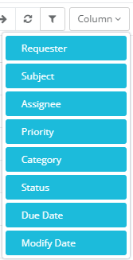
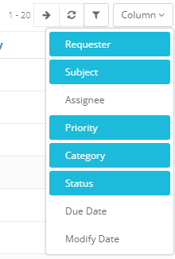
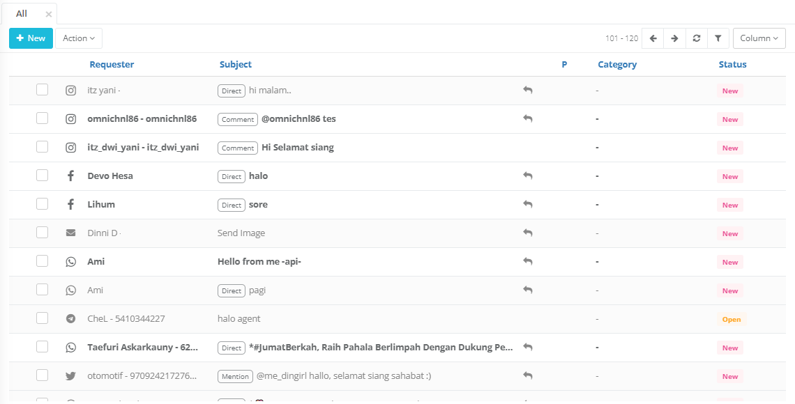
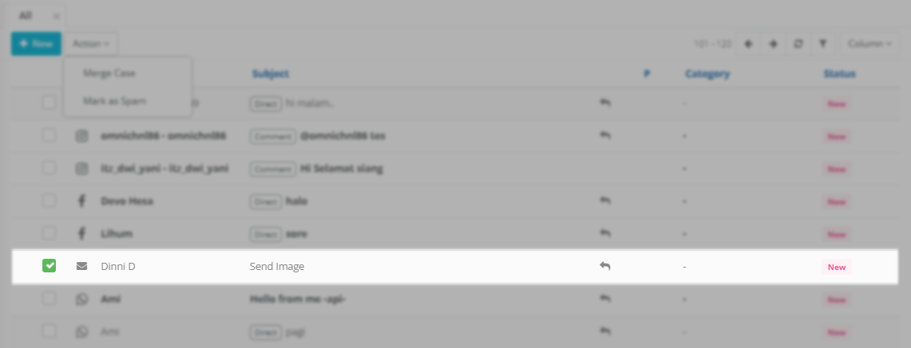
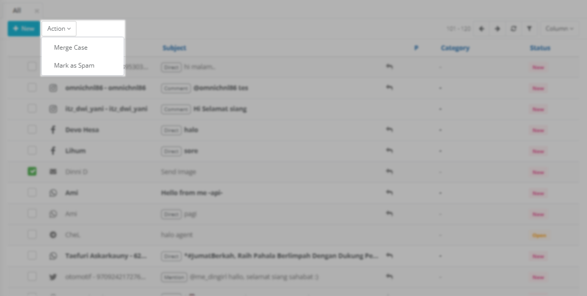
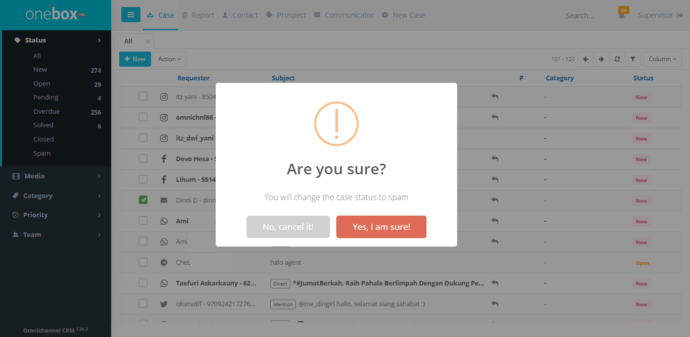
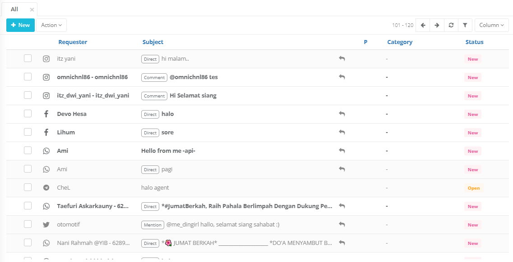
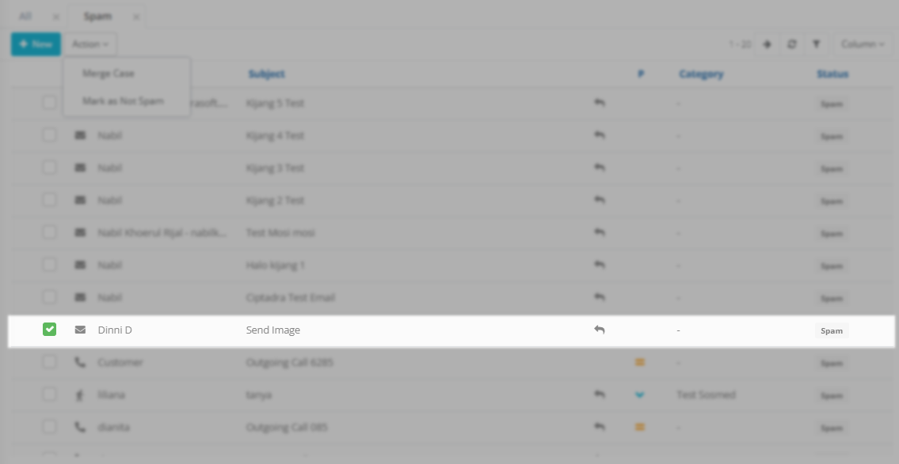
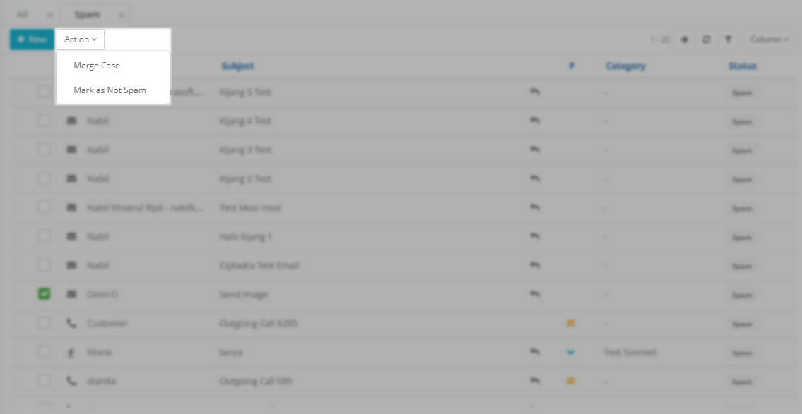

## Show Hide Colom Tabel

### Pengaturan show hide kolom tabel

Kolom pada tabel case dapat diatur untuk ditampilkan dan di sembunyikan sesuai dengan kebutuhan, default pengaturan awal semua kolom pada tabel ditampikan

untuk mengatur mana saja kolom tabel yang ingin ditampilkan bisa dengan cara:

1. klik tombol Colom pada screen list case

   

2. Pilih kolom mana yang akan ditampikan pada tabel

   

3. Setelah di pilih maka kolom pada tabel berubah sesuai kolom yang diatur
   

---

## Action

### Merge Case

### Spam

Fitur ini berfungsi untuk melakukan pemilihan case yang tidak relevan dengan cara mengelompokan case tersebut menjadi Spam.

### Bagaimana Cara Membuat Case Menjadi Spam?

1. Pilih case pada list
   
2. Klik Button action
3. Klik Mark As Spam
   
4. Klik Yes Im Sure pada alert konfirmasi
   

Ketika sudah melakukan cara diatas, maka case tersebut sudah termasuk dalam case spam dan tidak akan tampil di list case.

### Bagaimana Cara Mengembalikan Menjadi Bukan Case Spam?

1. Klik spam pada sidebar menu case
2. Pilih case pada list
   
3. Klik Button action
4. Klik Mark As Not Spam
   
5. Klik Yes Im Sure pada alert konfirmasi
   

Dengan langkah diatas maka status case tersebut berubah dan akan kembali pada list case sesuai dengan status awal case tersebut sebelum dirubah menjadi spam
