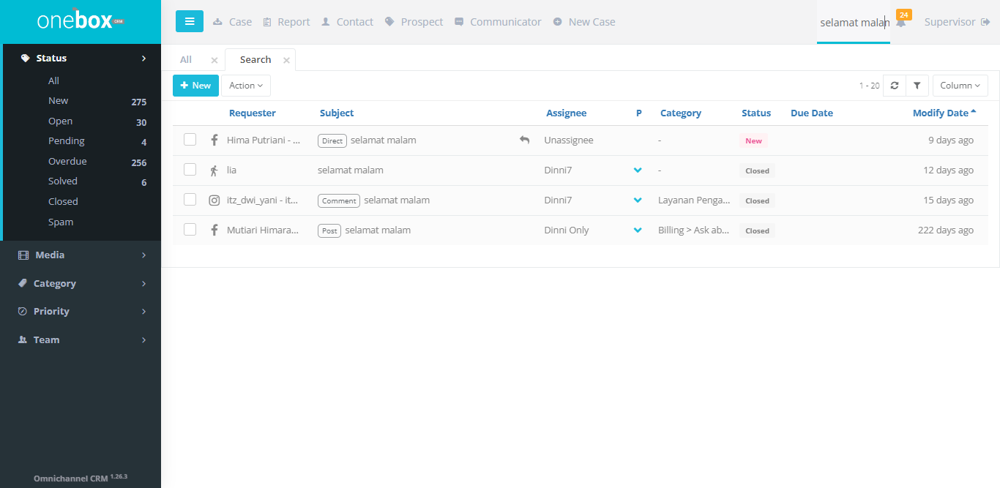

## Bagaimana Cara Mencari Case Mengunakan Filter Global

Untuk mencari case menggunakan filter global bisa berdasarkan **Id Case**, **Requester** **Subject**

Contoh pencarian mengunakan subject

Hasil pencarian case

