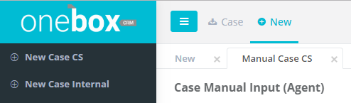
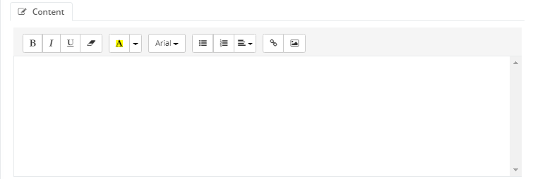

## Bagaimana Cara Membuat Manual Input dari Customer (New Case CS)

1. Pilih Menu New lalu pilih sub menu New Case CS

2. Pilih Media
3. Pilih tanggal message dibuat

4. Pilih kategori pencarian contact
5. Ketikkan nama contact
   Pilih nama contact yang sesuai atau

6. Klik add new contact jika data contact tidak ditemukan
<dd>
a. Isi Nama Contact
</dd>
<dd>
b. Isi akun contact (misal : email, nomor telepon dsb)
</dd>
<dd>
c. Klik Save Contact
</dd>

7. Isi subject,

8. Klik icon attachment jika ingin menambahkan lampiran (jika diperlukan)

9. Ketikkan detail pesan

10. Pilih status
11. Pilih prioritas
12. Pilih kategori
13. Pilih Due Date

14. Pilih PIC
15. Pilih Team
16. Pilih Product
17. Pilih Region

18. Isi Tag
19. Isi Description

20. Klik Save -- New

