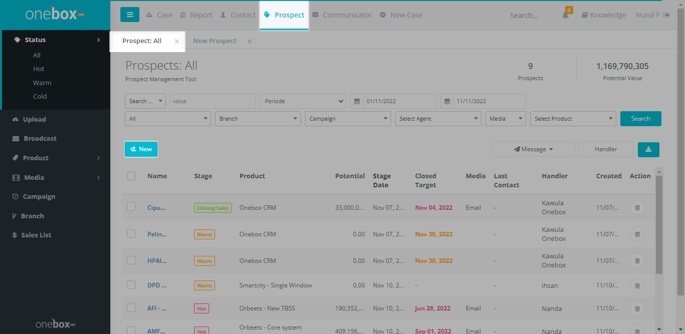
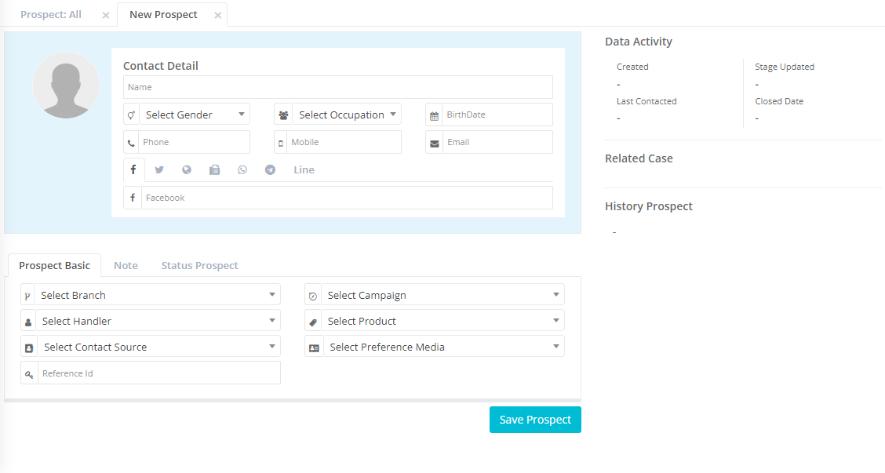
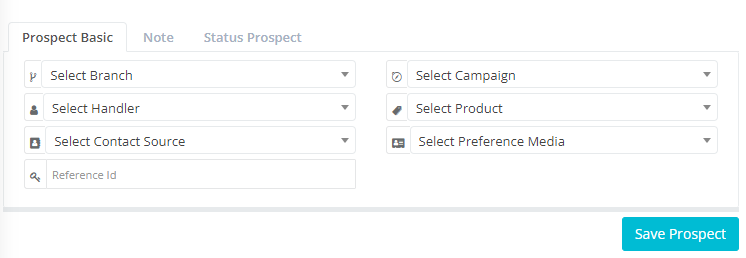
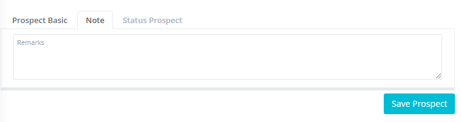
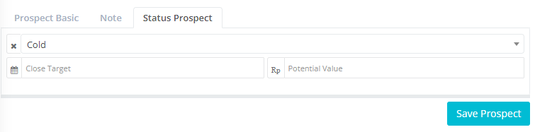

## Alur Pencatatan Prospect oleh Agent Marketing

Agent Marketing dapat membuat data prospek baru dengan cara sebagai berikut:

### Mencatat data prospek baru

Alur:

1. Klik menu Prospect Klik Sub Menu Status > All

2. Klik New untuk menambah data prospek baru, kemudian akan tampil:

4. Isi Contact detail
   
5. Isi Tab prospect basic
   
6. Isi Note (jika ada)
   
7. Status prospect
   
8. Klik Save untuk menyimpan data prospek
