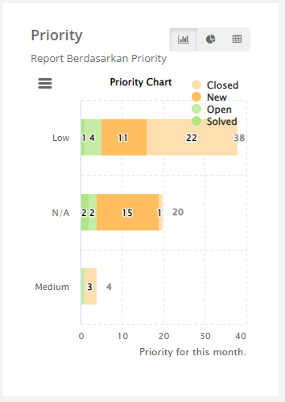

Menampilkan jumlah case yang sedang ditangani dan rekap case per kategori/category, media/channel, prioritas/priority dalam bentuk grafik batang dan juga menampilkan grafik pergerakan case per media pada periode tertentu (berdasarkan periode yang dipilih).

1. Filter Periode
1. Info case yang ada di antrian/In Queue (case yang berstatus New) dan sedang dikerjakan/In Progress (case yang berstatus Open, Pending dan Solve)
1. Info case yang masuk, case yang diselesaikan hari ini, jumlah interaksi dan persentase case yang diselesaikan langsung

   

1. Fitur Download All chart untuk mengunduh report yang ada pada dashboard

   

1. Fitur switch graphic, fitur ini untuk mengubah mode grafik batang menjadi pie, table atau sebaliknya

   

   <dl>

   a. Grafik Batang :

   

   b. Grafik Pie :

   

   c. Table :

   
   </dl>

1. Graphic Report by Category : menampilkan grafik case berdasarkan kategori pada periode yang telah dipilih sesuai filter periode

   

1. Graphic Report by Media : menampilkan grafik case berdasarkan media pada periode yang telah dipilih sesuai filter periode

   

1. Graphic Report by Priority : menampilkan grafik case berdasarkan prioritas pada periode yang telah dipilih sesuai filter periode

   

1. Report Media : menampilkan informasi berupa table untuk respon time dan resulution time per sesuai filter periode yang pilih

   

1. Report Method : menampilkan informasi berupa table (COMMENT, DIRECT, POST) untuk respon time dan resulution time per sesuai filter periode yang pilih

   

1. Trend Case by Media : menampilkan trend case berdasarkan media pada periode yang telah dipilih sesuai filter periode

   
