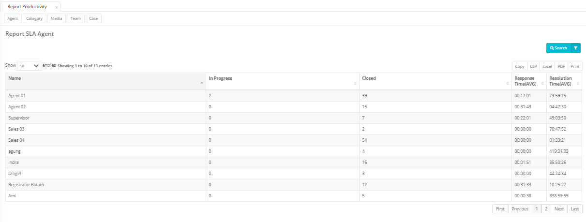
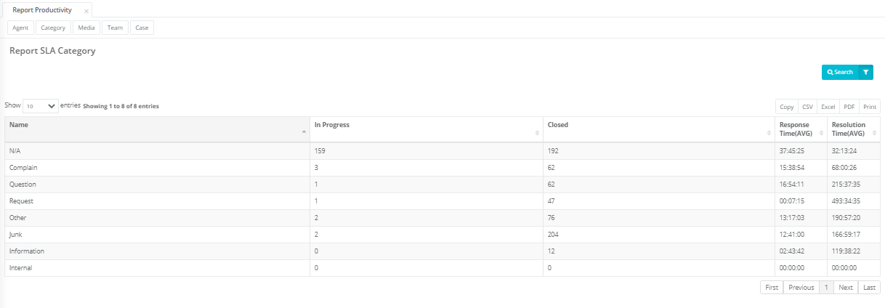
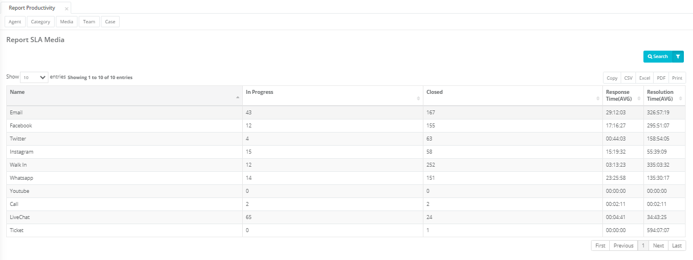
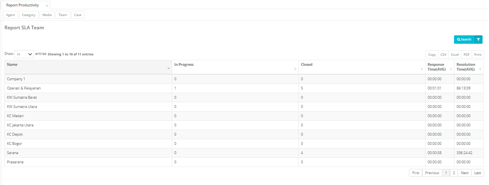
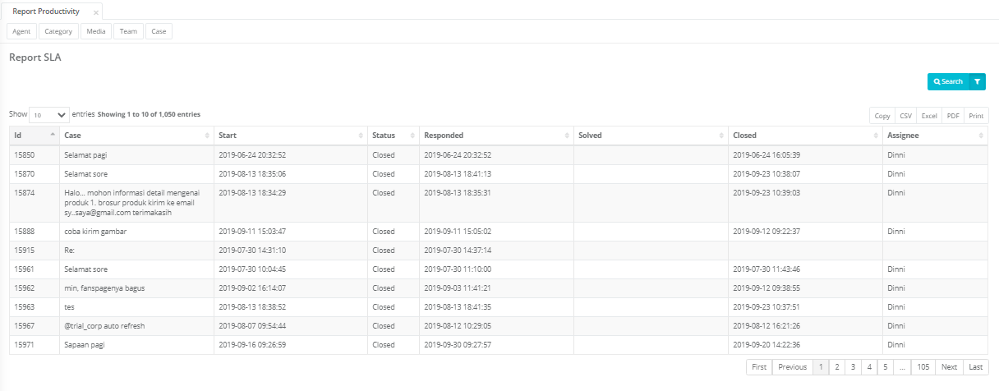

Report productivity terdiri dari Report Productivity by Agent, Productivity by Category, Productivity by Media, Productivity by Team dan Productivity by Case.

<dl>
<dt>Report produktivity menyajikan informasi :</dt>

<dd>- Case yang sedang dikerjakan : case yang berstatus Open, Pending, Solved</dd>
<dd>- Case yang telah diselesaikan : case yang berstatus Closed</dd>
<dd>- Response Time adalah waktu penanganan case, sejak case dihandle oleh user sampai dengan direspon ke customer</dd>
<dd>- Resolution Time adalah waltu penanganan case, sejak case dihandle oleh user sampai dengan diselesaikan (status case diupdate menjadi “Closed”)</dd>
</dl>

---

## Productivity by Agent

Report ini menampilkan produktivitas agent dalam menghandle case.

---

## Productivity by Category

Report ini menampilkan produktivitas case berdasarkan kategori.

---

## Productivity by Media

Report ini menampilkan produktivitas case berdasarkan media/channel.

---

## Productivity by Team

Report ini menampilkan produktivitas team dalam menghandle case.

---

## Productivity by Case

Report Productivity by case menampilkan informasi waktu case masuk, direspon, diselesaikan oleh team (solve) dan dinyatakan selesai (closed)

