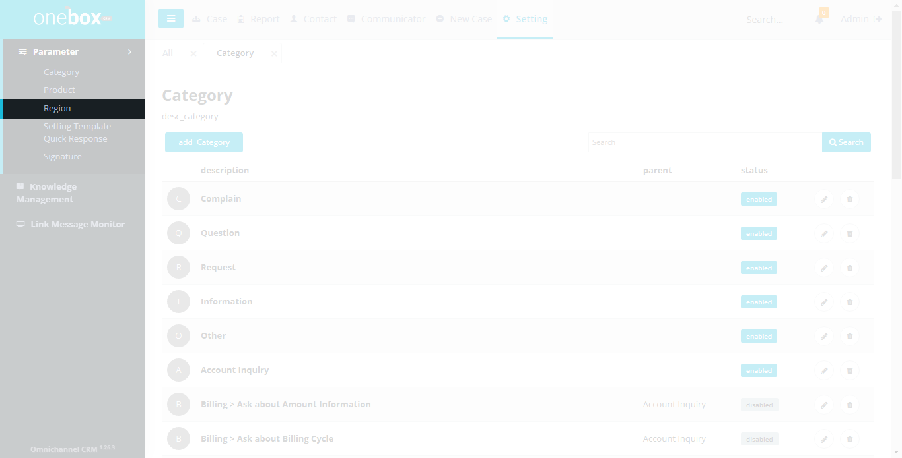
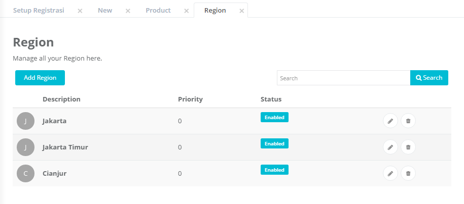
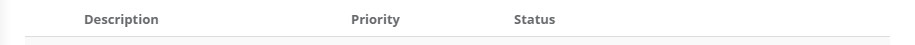
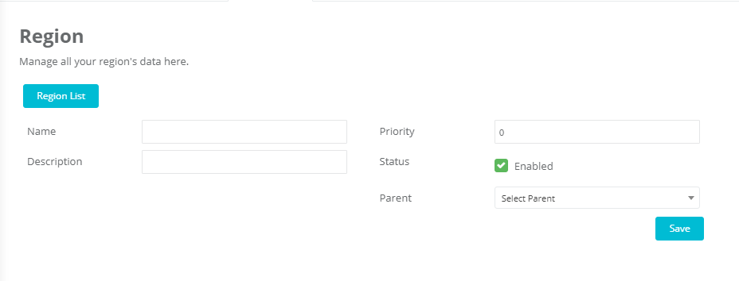
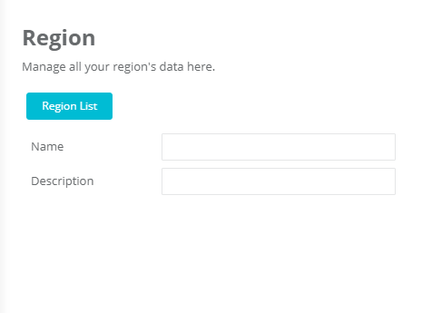
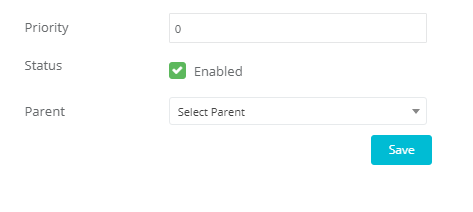

Sub menu Region digunakan untuk mengelola data lokasi/wilayah (region). Item produk ini ditampilkan pada combobox region di halaman Case Detail atau saat input manual case.

Menu : **Settings -> Parameter -> Region**

## List Lokasi/Wilayah (Region)

Menampilkan list lokasi yang berisi data lokasi

Fungsi dan fitur yang terdapat pada halaman ini yaitu Pencarian, Add Region, Edit Region, Delete Region

Menu : **Settings -> Parameter -> Region**

1. **Add** : Region Untuk menambah lokasi (Region)
2. **Textbox Search** :
   Ketikkan nama region yang ingin dicari.
3. **Search** :
   Klik untuk menampilkan hasil pencarian.
   
4. **Description** : Nama lokasi.
5. **Priority** : Urutan lokasi yang akan ditampilkan.
6. **Status** : Status lokasi ditampilkan(enable) atau tidak(disable) pada combobox lokasi.
   
7.  : Untuk mengubah data region.
8.  : Untuk menghapus region.

## Cara Menambahkan, Mengubah atau Menghapus Lokasi/Wilayah (Region)

- Cara menambahkan Lokasi (Region): **Settings -> Parameter -> Region -> Add Location/Region**
- Cara mengubah Lokasi (Region): **Settings -> Parameter -> Region -> (Icon Edit Location/Region)**
- Cara menghapus Lokasi (Region): **Settings -> Parameter -> Region -> (Icon Delete Location/Region)**

1. **Region List** : Untuk kembali ke halaman list lokasi
2. **Name** : Input ID untuk lokasi tersebut
3. **Description** : Keterangan untuk lokasi yang diinput
   
4. **Priority** : Untuk memberi prioritas urutan dari lokasi yang diinput
5. **Status** : Ceklist enable jika ingin ditampilkan di combobox, unceklist jika tidak ingin ditampilkan namun masih
6. **Parent** : Memilih induk dari lokasi yang diinput. Memilih “Select Parent” jika ingin dijadikan induk (tidak memiliki induk).
7. **Save** : Untuk menyimpan data, lalu menampilkan list lokasi
   
